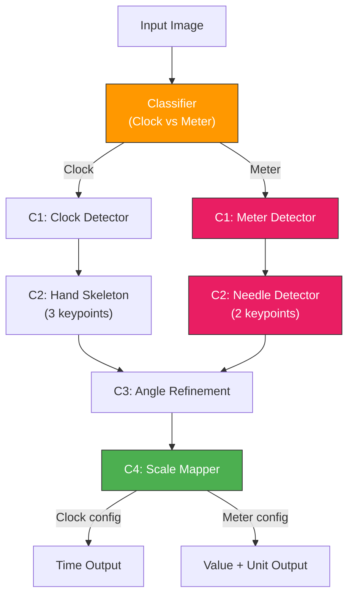
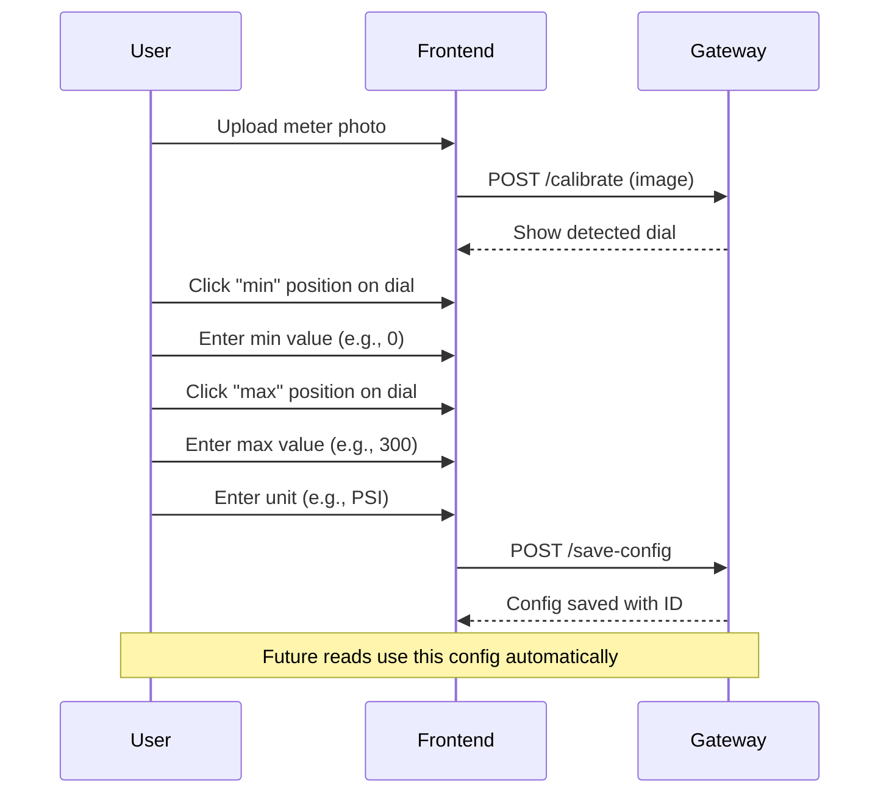
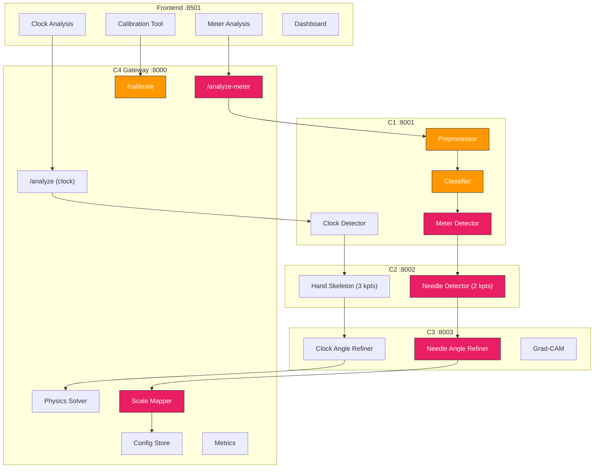

# Extending Clock AI → Universal Analog Meter Reading System

## 1. Problem Analysis

### What We Have (Clock System)
| Component | Current Purpose | File |
|---|---|---|
| **C1** | Detects clocks via YOLO | [c1/main.py](file:///d:/Research-Project/services/c1_localization/main.py) |
| **C2** | Extracts 3 keypoints (center + 2 tips) | [c2/main.py](file:///d:/Research-Project/services/c2_skeleton/main.py) |
| **C3** | Refines angles via ResNet18 + Grad-CAM | [c3/main.py](file:///d:/Research-Project/services/c3_angle_refinement/main.py) |
| **C4** | Maps angles → **time** (hardcoded 12-hour scale) | [c4/main.py](file:///d:/Research-Project/services/c4_gateway/main.py) |

### What We Need (Industrial Meters)
| Meter Type | Scale | Unit | Needles |
|---|---|---|---|
| Pressure gauge (boiler) | 0–300 | PSI / bar | 1 needle |
| Temperature meter | 0–200 | °C / °F | 1 needle |
| Thermostatic meter | -20–120 | °C | 1 needle |
| Washing machine meter | 0–100 | custom | 1 needle |
| Plant monitoring gauge | varies | varies | 1–2 needles |

### Key Differences: Clock vs Industrial Meter

| Aspect | Clock | Industrial Meter |
|---|---|---|
| **Needles** | Always 2 (hour + minute) | Usually 1 (sometimes 2) |
| **Scale** | Fixed: 0–360° = 12 hours | Variable: any range |
| **Angle range** | Full 360° | Often partial arc (e.g., 270°) |
| **Zero position** | Top (12 o'clock) | Varies per dial |
| **Labels** | Numbers 1–12 | Any numeric scale |
| **Environment** | Indoor, clean | Steam, dust, vibration |

---

## 2. Recommended Model Architecture

> [!IMPORTANT]
> **Recommendation: Option 2 — Keep clock model + Add industrial model + Auto-classifier**

### Why Not Option 1 (One Generalized Model)?

- Retraining the clock model risks **degrading existing accuracy**
- Clock hands (2 long thin lines) look very different from industrial needles (1 short thick pointer)
- Scale markings are fundamentally different (numbers vs tick marks)

### Recommended Architecture: Option 2



> [!TIP]
> The classifier can be a lightweight MobileNet or even a simple CNN, since "clock vs gauge" is a very easy classification task.

---

## 3. Component-Level Modification Plan

### C1 — Localization Service (`:8001`)

**Current**: Detects clocks only.
**Modification**: Detect any circular analog dial.

```diff
-   c1_model = YOLO(MODEL_PATH)            # clock-only
+   clock_model = YOLO(CLOCK_MODEL_PATH)    # existing clock model
+   meter_model = YOLO(METER_MODEL_PATH)    # new industrial model
+   classifier = load_classifier()           # clock vs meter
```

#### [MODIFY] [main.py](file:///d:/Research-Project/services/c1_localization/main.py)

- **Add** a `meter_type` parameter to `/localize` endpoint
- **Add** auto-classification when `meter_type="auto"`
- **Load** two YOLO models (clock + meter) or one retrained generalized model
- **Add** preprocessing pipeline for industrial images

**New API contract:**
```
POST /localize
  Input:  image file + meter_type ("clock" | "meter" | "auto")
  Output: {
    "found": true,
    "detected_type": "meter",        // NEW
    "bbox": [x1, y1, x2, y2],
    "cropped_image": "<base64>",
    "visualization": "<base64>"
  }
```

**New preprocessing functions needed:**
```python
def _enhance_industrial(img):
    """Handle steam, fog, reflections, dirt."""
    # 1. CLAHE contrast enhancement
    lab = cv2.cvtColor(img, cv2.COLOR_BGR2LAB)
    l, a, b = cv2.split(lab)
    clahe = cv2.createCLAHE(clipLimit=3.0, tileGridSize=(8,8))
    l = clahe.apply(l)
    enhanced = cv2.merge([l, a, b])
    enhanced = cv2.cvtColor(enhanced, cv2.COLOR_LAB2BGR)
    
    # 2. Deblurring (motion blur from vibration)
    enhanced = cv2.GaussianBlur(enhanced, (0,0), 3)
    enhanced = cv2.addWeighted(img, 1.5, enhanced, -0.5, 0)
    
    # 3. Perspective correction
    enhanced = _correct_perspective(enhanced)
    
    return enhanced
```

---

### C2 — Skeleton/Needle Service (`:8002`)

**Current**: Extracts 3 keypoints (center + 2 hand tips) for clocks.
**Modification**: Support 2 keypoints (center + 1 needle tip) for meters.

#### [MODIFY] [main.py](file:///d:/Research-Project/services/c2_skeleton/main.py)

**Key changes:**
```diff
- # Always expects 3 keypoints (center, tip1, tip2)
- kpts = results.keypoints.data[0].cpu().numpy()
- center = kpts[0][:2].tolist()
- tip1 = kpts[1][:2].tolist()
- tip2 = kpts[2][:2].tolist()
+ # Flexible keypoint extraction
+ kpts = results.keypoints.data[0].cpu().numpy()
+ center = kpts[0][:2].tolist()
+ tip1 = kpts[1][:2].tolist()
+ tip2 = kpts[2][:2].tolist() if len(kpts) > 2 else None  # meters have 1 needle
```

**New API contract:**
```
POST /extract-skeleton
  Input:  image file + device_type ("clock" | "meter")
  Output: {
    "device_type": "meter",
    "keypoints": {
      "center": [x, y],
      "tip1": [x, y],
      "tip2": [x, y] | null     // null for single-needle meters
    },
    "angles": {
      "needle": 145.3,           // single angle for meters
      "hand1": null,             // null for meters
      "hand2": null
    },
    "visualization": "<base64>"
  }
```

---

### C3 — Angle Refinement Service (`:8003`)

**Current**: Refines angles for clock hands.
**Modification**: Also refines needle angles for meters (same principle — angle predicting from crop).

#### [MODIFY] [main.py](file:///d:/Research-Project/services/c3_angle_refinement/main.py)

**Changes needed:**
- Accept single needle input (not just 2 hands)
- Support different crop sizes for industrial needles (thicker than clock hands)
- Train or fine-tune ResNet18 on industrial needle crops

```diff
  class RefineRequest(BaseModel):
      image: str
      keypoints: dict
      rough_angles: dict
+     device_type: str = "clock"    # "clock" or "meter"
```

> [!NOTE]
> C3 requires the **least changes** because angle refinement is fundamentally the same operation for both clocks and meters — predicting an angular correction from a rotated crop.

---

### C4 — Gateway + Scale Mapper (`:8000`)

**This is where the biggest change happens.** The current `physics.py` is hardcoded for 12-hour clock mapping. We need a **configurable scale mapper**.

#### [MODIFY] [physics.py](file:///d:/Research-Project/services/c4_gateway/physics.py) → Rename to `scale_mapper.py`

**Current physics solver** (clock-only):
```python
# Hardcoded: 720 minutes, 0.5°/min hour hand, 6°/min minute hand
self.possible_minutes = np.arange(0, 720)
self.theory_h = (self.possible_minutes * 0.5) % 360
self.theory_m = (self.possible_minutes * 6.0) % 360
```

**New configurable scale mapper:**
```python
class ScaleMapper:
    """Universal angle-to-value mapper with per-device calibration."""
    
    def map_value(self, angle: float, config: dict) -> dict:
        """
        config = {
            "scale_min": 0,          # minimum value on dial
            "scale_max": 300,        # maximum value on dial
            "angle_min": 45,         # angle at minimum (degrees from 12 o'clock)
            "angle_max": 315,        # angle at maximum
            "unit": "PSI",           # display unit
            "precision": 1,          # decimal places
            "alert_thresholds": {
                "warning": 200,
                "critical": 280
            }
        }
        """
        # Linear interpolation: angle → value
        angle_range = config["angle_max"] - config["angle_min"]
        value_range = config["scale_max"] - config["scale_min"]
        
        normalized = (angle - config["angle_min"]) / angle_range
        normalized = max(0, min(1, normalized))  # clamp
        
        value = config["scale_min"] + (normalized * value_range)
        value = round(value, config.get("precision", 1))
        
        # Alert check
        alert = None
        thresholds = config.get("alert_thresholds", {})
        if thresholds.get("critical") and value >= thresholds["critical"]:
            alert = "CRITICAL"
        elif thresholds.get("warning") and value >= thresholds["warning"]:
            alert = "WARNING"
        
        return {
            "value": value,
            "unit": config["unit"],
            "display": f"{value} {config['unit']}",
            "alert": alert,
            "reasoning": f"Angle={angle:.1f}° → {value} {config['unit']}"
        }
```

#### [NEW] `configs/` — Meter Configuration Files

```json
// configs/boiler_pressure.json
{
    "device_id": "boiler_pressure_01",
    "name": "Boiler Room Pressure Gauge",
    "type": "meter",
    "scale_min": 0,
    "scale_max": 300,
    "angle_min": 45,
    "angle_max": 315,
    "unit": "PSI",
    "precision": 0,
    "alert_thresholds": {
        "warning": 200,
        "critical": 280
    }
}
```

```json
// configs/clock.json (backward compatible)
{
    "device_id": "analog_clock",
    "name": "Analog Clock",
    "type": "clock",
    "scale_type": "clock_12h"
}
```

#### [MODIFY] [main.py](file:///d:/Research-Project/services/c4_gateway/main.py) — Add meter analysis endpoint

```diff
+ @app.post("/analyze-meter")
+ async def analyze_meter(
+     file: UploadFile = File(...),
+     config_id: str = Form("auto"),
+     force_expert: bool = Form(False)
+ ):
+     """Industrial meter analysis pipeline."""
+     # C1 → C2 → C3 → ScaleMapper (not PhysicsSolver)
```

> [!IMPORTANT]
> The `/analyze` endpoint stays **unchanged** for backward compatibility. The new `/analyze-meter` endpoint handles industrial meters with configuration.

#### [MODIFY] [orchestrator.py](file:///d:/Research-Project/services/c4_gateway/orchestrator.py) — Pass device_type

```diff
  def call_c1(image_bytes, filename, device_type="clock"):
  def call_c2(cropped_b64, device_type="clock"):
  def call_c3(cropped_b64, keypoints, angles, device_type="clock"):
```

---

## 4. Calibration System Design

A user must calibrate each meter **once** before first use.



**Calibration data stored:**
```
configs/
├── boiler_pressure_01.json
├── temp_sensor_02.json
├── wash_machine_03.json
└── clock.json              # default
```

---

## 5. Dataset Strategy

### For C1 (Dial Detection)

| Source | Images | Notes |
|---|---|---|
| Roboflow "gauge detection" | ~2,000 | Pressure gauges, thermometers |
| Custom factory photos | ~500 | Your specific boiler/equipment |
| Augmented from existing | ~1,000 | Rotation, brightness, fog overlay |
| **Total** | **~3,500** | |

**Annotation format:** YOLO bbox (`class x_center y_center width height`)

### For C2 (Needle Detection)

| Source | Images | Notes |
|---|---|---|
| Annotated from C1 dataset | ~2,000 | Add keypoints: center + needle tip |
| Synthetic generation | ~1,000 | Rendered gauges with known positions |
| **Total** | **~3,000** | |

**Annotation format:** YOLO-Pose (bbox + 2 keypoints)

### For Classifier (Clock vs Meter)

| Class | Images |
|---|---|
| Clock | ~1,000 (from existing dataset) |
| Industrial Meter | ~1,000 (from gauge dataset) |
| **Total** | **~2,000** |

> [!TIP]
> **Quick win:** Start with just 200–300 industrial meter images. Fine-tune the existing YOLO from the clock checkpoint — this converges much faster than training from scratch.

---

## 6. Model Training Strategy

### Phase 1: Fine-tune C1 for Meters (Fastest)
```bash
# Use existing clock YOLO as starting point
yolo detect train \
    data=meter_dataset.yaml \
    model=services/c1_localization/models/best.pt \
    epochs=50 \
    imgsz=640 \
    name=c1_meter
```

### Phase 2: Train C2 Needle Detector
```bash
# YOLO-Pose with 2 keypoints (center + tip)
yolo pose train \
    data=needle_dataset.yaml \
    model=yolov8n-pose.pt \
    epochs=100 \
    imgsz=640 \
    name=c2_needle
```

### Phase 3: Fine-tune C3 for Needle Refinement
```python
# Fine-tune existing ResNet18 on needle crops
# Same architecture, just different training data
model.load_state_dict(torch.load("services/c3_angle_refinement/models/best.pth"))
# Fine-tune on industrial needle crops
```

### Phase 4: Train Classifier
```python
# Lightweight MobileNetV3 or even simpler
from torchvision.models import mobilenet_v3_small
classifier = mobilenet_v3_small(num_classes=2)  # clock vs meter
```

---

## 7. Accuracy Improvements for Industrial Environments

### Preprocessing Pipeline

| Challenge | Solution | Implementation |
|---|---|---|
| **Steam/fog** | CLAHE contrast enhancement | `cv2.createCLAHE()` |
| **Vibration blur** | Unsharp masking | `cv2.addWeighted()` |
| **Reflections** | Polarization + histogram equalization | Custom filter |
| **Dirt/dust** | Morphological opening | `cv2.morphologyEx()` |
| **Camera angle** | Perspective correction | `cv2.getPerspectiveTransform()` |
| **Low light** | Gamma correction | LUT-based |

### Needle Segmentation Improvement
```python
def _segment_needle(img):
    """Robust needle detection for industrial conditions."""
    # 1. Convert to HSV for color-based segmentation
    hsv = cv2.cvtColor(img, cv2.COLOR_BGR2HSV)
    
    # 2. Detect dark needle on light background
    gray = cv2.cvtColor(img, cv2.COLOR_BGR2GRAY)
    _, thresh = cv2.threshold(gray, 0, 255, cv2.THRESH_BINARY_INV + cv2.THRESH_OTSU)
    
    # 3. Morphological cleanup
    kernel = cv2.getStructuringElement(cv2.MORPH_ELLIPSE, (3,3))
    cleaned = cv2.morphologyEx(thresh, cv2.MORPH_CLOSE, kernel)
    
    # 4. Find needle as longest line (Hough)
    lines = cv2.HoughLinesP(cleaned, 1, np.pi/180, 50, minLineLength=30)
    
    return lines
```

### Confidence Scoring
```python
def calculate_confidence(angle, config, detection_score):
    """Multi-factor confidence for meter readings."""
    conf = 1.0
    
    # Factor 1: Detection confidence from YOLO
    conf *= detection_score
    
    # Factor 2: Is angle within valid range?
    if angle < config["angle_min"] or angle > config["angle_max"]:
        conf *= 0.5  # Penalty for out-of-range
    
    # Factor 3: Image quality score
    # (blur detection, contrast check)
    
    return round(conf, 2)
```

---

## 8. Updated Architecture — Final



**Legend:** 🟥 Pink = New components | 🟧 Orange = Modified components | Default = Unchanged

---

## 9. Step-by-Step Implementation Roadmap

### Phase 1: Foundation (Week 1–2)
- [ ] Create `ScaleMapper` class in C4 (replaces hardcoded physics for meters)
- [ ] Add meter configuration JSON schema + storage
- [ ] Add `/analyze-meter` endpoint to C4 Gateway
- [ ] Add `device_type` parameter to C1, C2, C3 APIs
- [ ] Add preprocessing pipeline (`_enhance_industrial()`) to C1

### Phase 2: Data Collection (Week 2–3)
- [ ] Collect 200–300 industrial gauge images from factory floors
- [ ] Annotate with YOLO format (bounding boxes)
- [ ] Annotate keypoints (center + needle tip) for C2
- [ ] Split: 80% train, 10% val, 10% test

### Phase 3: Model Training (Week 3–4)
- [ ] Fine-tune C1 YOLO on industrial meter bboxes
- [ ] Train C2 YOLO-Pose for needle keypoints (2 keypoints)
- [ ] Fine-tune C3 ResNet18 on needle angle crops
- [ ] Train lightweight classifier (clock vs meter)

### Phase 4: Integration (Week 4–5)
- [ ] Deploy trained models into service directories
- [ ] Wire multi-model loading in C1 and C2
- [ ] Add calibration endpoint + workflow in C4
- [ ] Build meter analysis page in frontend

### Phase 5: Accuracy & Hardening (Week 5–6)
- [ ] Add CLAHE, deblur, perspective correction
- [ ] Add confidence scoring
- [ ] Add alert threshold monitoring
- [ ] Test under industrial conditions (steam, vibration)
- [ ] Benchmark accuracy vs manual readings

---

## 10. File Change Summary

| Service | File | Change Type | What Changes |
|---|---|---|---|
| **C1** | `main.py` | MODIFY | Add multi-model, classifier, preprocessor |
| **C1** | `models/meter_best.pt` | NEW | Industrial meter detection model |
| **C1** | `models/classifier.pth` | NEW | Clock vs meter classifier |
| **C2** | `main.py` | MODIFY | Support 1-needle (2 keypoints) mode |
| **C2** | `models/needle_best.pt` | NEW | Needle detection model |
| **C3** | `main.py` | MODIFY | Accept `device_type`, single needle input |
| **C3** | `models/needle_best.pth` | NEW | Needle angle refinement model |
| **C4** | `physics.py` | KEEP | Unchanged (backward compatible) |
| **C4** | `scale_mapper.py` | NEW | Configurable angle→value mapping |
| **C4** | `main.py` | MODIFY | Add `/analyze-meter`, `/calibrate` |
| **C4** | `orchestrator.py` | MODIFY | Pass `device_type` to services |
| **C4** | `configs/*.json` | NEW | Per-meter calibration configs |
| **Frontend** | `frontend.py` | MODIFY | Add Meter Analysis page + Calibration UI |

> [!CAUTION]
> The existing `/analyze` endpoint and clock pipeline remain **100% untouched**. All meter functionality is **additive** — no existing behavior is changed.
