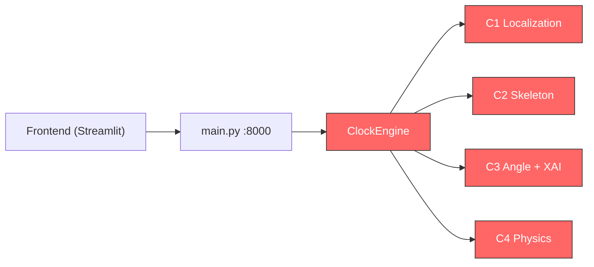
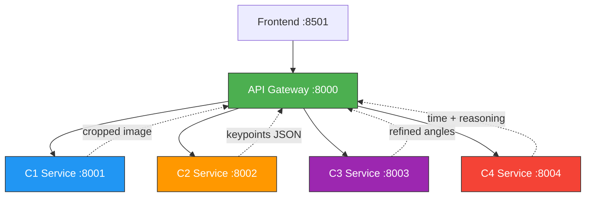
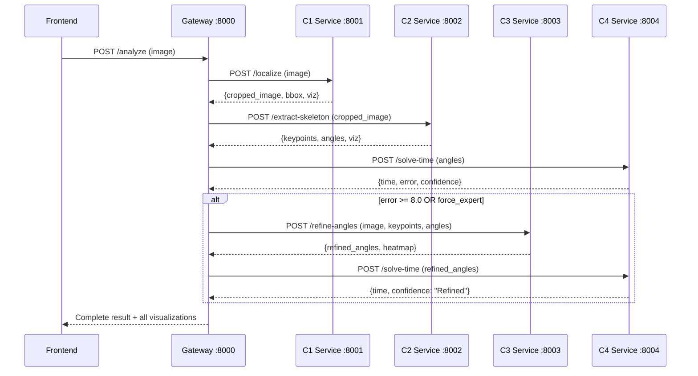

# Decomposing Clock AI into 4 Independent Microservices

## Current Architecture (Monolithic)

All 4 components live inside a single `ClockEngine` class in [engine.py](file:///d:/Research-Project/app/core/engine.py). The single FastAPI server in [main.py](file:///d:/Research-Project/app/main.py) orchestrates everything, and [frontend.py](file:///d:/Research-Project/app/frontend.py) calls only this one backend.



> [!WARNING]
> **Problem**: All components share the same process, same memory, same dependencies. A crash in C3 brings down C1/C2/C4. You can't scale or deploy them independently.

---

## Proposed Architecture (Microservices)

Each component becomes its own FastAPI service on its own port, with its own `requirements.txt` and model files. An **API Gateway** (or the frontend directly) orchestrates calls between them.



---

## Component Breakdown

### C1 — Clock Localization Service (`:8001`)

| Aspect | Detail |
|---|---|
| **Owner** | Member 1 |
| **Model** | YOLO (`models/c1_localization/best.pt`) |
| **Input** | Raw image (multipart upload) |
| **Output** | Cropped clock image + bounding box coordinates |
| **Dependencies** | `ultralytics`, `opencv-python`, `numpy` |

**Current code** (lines 96–113 in [engine.py](file:///d:/Research-Project/app/core/engine.py#L96-L113)):
- `_localize_clock()` — runs YOLO detection, returns crop
- `_draw_bbox()` — visualization helper

**API Design:**
```
POST /localize
  Input:  image file (multipart)
  Output: {
    "found": true,
    "bbox": [x1, y1, x2, y2],
    "cropped_image": "<base64>",
    "visualization": "<base64>"
  }
```

---

### C2 — Hand Skeleton Service (`:8002`)

| Aspect | Detail |
|---|---|
| **Owner** | Member 2 |
| **Model** | YOLO-Pose (`models/c2_hands_skeleton/best.pt`) |
| **Input** | Cropped clock image (from C1) |
| **Output** | Keypoints (center, tip1, tip2) + raw angles |
| **Dependencies** | `ultralytics`, `opencv-python`, `numpy` |

**Current code** (lines 115–128, 165–179 in [engine.py](file:///d:/Research-Project/app/core/engine.py#L115-L179)):
- YOLO-Pose keypoint extraction
- `_draw_skeleton()` — visualization
- `_get_angle()` — geometric angle calc

**API Design:**
```
POST /extract-skeleton
  Input:  cropped clock image (multipart)
  Output: {
    "keypoints": {
      "center": [x, y],
      "tip1": [x, y],
      "tip2": [x, y]
    },
    "angles": {"hand1": 127.3, "hand2": 312.5},
    "visualization": "<base64>"
  }
```

---

### C3 — Angle Refinement Service (`:8003`)

| Aspect | Detail |
|---|---|
| **Owner** | Member 3 |
| **Model** | ResNet18 (`models/c3_angle_regression/best.pth`) + Grad-CAM |
| **Input** | Cropped clock image + keypoints + rough angles |
| **Output** | Refined angles + XAI heatmap |
| **Dependencies** | `torch`, `torchvision`, `grad-cam`, `opencv-python`, `Pillow` |

**Current code** (lines 57–62, 82–90, 199–252 in [engine.py](file:///d:/Research-Project/app/core/engine.py#L57-L252) + [xai.py](file:///d:/Research-Project/app/core/xai.py)):
- `_get_c3_arch()` — model architecture
- `_get_crop()` — rotated crop extraction
- Expert path refinement logic
- `XaiVisualizer` — Grad-CAM heatmap generation

**API Design:**
```
POST /refine-angles
  Input:  {
    "image": "<base64 of cropped clock>",
    "keypoints": {"center": [x,y], "tip1": [x,y], "tip2": [x,y]},
    "rough_angles": {"hand1": 127.3, "hand2": 312.5}
  }
  Output: {
    "refined_angles": {"hand1": 125.1, "hand2": 310.8},
    "crops": ["<base64>", "<base64>"],
    "heatmap": "<base64>",
    "debug": ["Hand 0: Accepted C3 delta -2.2°"]
  }
```

---

### C4 — Physics & Orchestration Service (`:8004` or Gateway `:8000`)

| Aspect | Detail |
|---|---|
| **Owner** | Member 4 |
| **Model** | No ML model — pure physics/math |
| **Input** | Two angles (hand1, hand2) |
| **Output** | Resolved time + confidence + reasoning |
| **Dependencies** | `numpy`, `fastapi` |
| **Also owns** | [metrics.py](file:///d:/Research-Project/app/core/metrics.py) — analytics tracking |

**Current code** (lines 37–41, 69–80, 184–197 in [engine.py](file:///d:/Research-Project/app/core/engine.py#L37-L197) + [metrics.py](file:///d:/Research-Project/app/core/metrics.py)):
- `_solve_physics()` — hour/minute resolution
- Physics constants (theory arrays)
- `MetricsTracker` — SQLite analytics

**API Design:**
```
POST /solve-time
  Input:  {"hand1_angle": 127.3, "hand2_angle": 312.5}
  Output: {
    "time": "4:25",
    "hour": 4,
    "minute": 25,
    "error": 3.2,
    "confidence": "High",
    "reasoning": "Physics: H=127.3°, M=312.5° → Time=4:25"
  }
```

---

## Data Flow Between Services



---

## Proposed Directory Structure

```
Research-Project/
├── services/
│   ├── c1_localization/          # Member 1
│   │   ├── main.py               # FastAPI app on :8001
│   │   ├── model.py              # YOLO localization logic
│   │   ├── requirements.txt      # ultralytics, opencv, fastapi
│   │   └── models/
│   │       └── best.pt
│   │
│   ├── c2_skeleton/              # Member 2
│   │   ├── main.py               # FastAPI app on :8002
│   │   ├── model.py              # YOLO-Pose + angle calc
│   │   ├── requirements.txt      # ultralytics, opencv, fastapi
│   │   └── models/
│   │       └── best.pt
│   │
│   ├── c3_angle_refinement/      # Member 3
│   │   ├── main.py               # FastAPI app on :8003
│   │   ├── model.py              # ResNet18 angle regression
│   │   ├── xai.py                # Grad-CAM visualizer
│   │   ├── requirements.txt      # torch, torchvision, grad-cam, fastapi
│   │   └── models/
│   │       └── best.pth
│   │
│   ├── c4_gateway/               # Member 4
│   │   ├── main.py               # FastAPI gateway on :8000
│   │   ├── physics.py            # Physics solver
│   │   ├── metrics.py            # Analytics tracker
│   │   ├── orchestrator.py       # Calls C1→C2→C3→C4 via HTTP
│   │   └── requirements.txt      # numpy, pandas, fastapi, requests
│   │
│   └── docker-compose.yml        # Run all services together
│
├── app/
│   └── frontend.py               # Streamlit UI (unchanged)
│
└── README.md
```

---

## What Each Member Extracts from `engine.py`

| Lines | Current Location | Moves To | What It Does |
|---|---|---|---|
| 17–18 | `__init__` | `c1_localization/model.py` | C1 model loading |
| 49–55 | `_load_yolo()` | Shared or duplicated | YOLO loader helper |
| 96–113 | `_localize_clock()`, `_draw_bbox()` | `c1_localization/model.py` | Clock detection + bbox viz |
| 20–22 | `__init__` | `c2_skeleton/model.py` | C2 model loading |
| 64–67 | `_get_angle()` | `c2_skeleton/model.py` | Geometric angle calculation |
| 116–128 | `_draw_skeleton()` | `c2_skeleton/model.py` | Skeleton visualization |
| 165–179 | `analyze()` C2 section | `c2_skeleton/model.py` | Keypoint extraction pipeline |
| 24–47 | `__init__` C3 section | `c3_angle_refinement/model.py` | C3 model + transforms |
| 57–62 | `_get_c3_arch()` | `c3_angle_refinement/model.py` | ResNet18 architecture |
| 82–90 | `_get_crop()` | `c3_angle_refinement/model.py` | Rotated crop extraction |
| 199–252 | `analyze()` expert path | `c3_angle_refinement/model.py` | Refinement pipeline |
| 1–30 | `xai.py` | `c3_angle_refinement/xai.py` | Grad-CAM (already separate!) |
| 37–41 | `__init__` C4 section | `c4_gateway/physics.py` | Physics constants |
| 69–80 | `_solve_physics()` | `c4_gateway/physics.py` | Time resolution |
| 131–149 | `_draw_angles_on_img()` | `c4_gateway/` or `c3_angle_refinement/` | Angle viz overlay |
| 1–148 | `metrics.py` | `c4_gateway/metrics.py` | Analytics (already separate!) |

---

## Key Benefits

| Benefit | Explanation |
|---|---|
| **Independent Deployment** | Each member deploys their service without affecting others |
| **Independent Scaling** | C1 is fast, C3 is slow — scale C3 separately |
| **Fault Isolation** | C3 crash doesn't kill C1/C2/C4 |
| **Independent Testing** | Each service has its own test suite |
| **Technology Freedom** | C4 could be rewritten in Go; C3 could use TensorRT |
| **Clear Ownership** | Each member owns one service end-to-end |

---

## Verification Plan

### Running All Services
```bash
# Terminal 1: C1
cd services/c1_localization && uvicorn main:app --port 8001

# Terminal 2: C2
cd services/c2_skeleton && uvicorn main:app --port 8002

# Terminal 3: C3
cd services/c3_angle_refinement && uvicorn main:app --port 8003

# Terminal 4: Gateway + C4
cd services/c4_gateway && uvicorn main:app --port 8000

# Terminal 5: Frontend
streamlit run app/frontend.py
```

### Testing Individual Services
```bash
# Test C1 independently
curl -X POST http://localhost:8001/localize -F "file=@clock.jpg"

# Test C2 independently
curl -X POST http://localhost:8002/extract-skeleton -F "file=@cropped_clock.jpg"

# Test C4 independently
curl -X POST http://localhost:8004/solve-time \
  -H "Content-Type: application/json" \
  -d '{"hand1_angle": 127.3, "hand2_angle": 312.5}'
```

### Integration Test via Gateway
```bash
# Full pipeline through gateway (same as current)
curl -X POST http://localhost:8000/analyze -F "file=@clock.jpg"
```

> [!IMPORTANT]
> The frontend (`frontend.py`) **does not need to change** — it still calls `localhost:8000`. The Gateway handles all inter-service routing internally.
