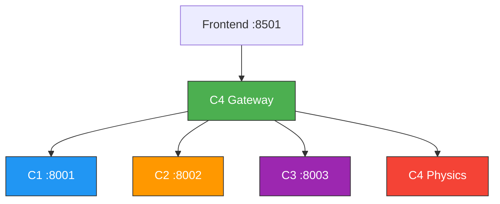

# Microservice Architecture — Walkthrough

## What Was Done

Decomposed the monolithic `ClockEngine` class into **4 independent microservices**, each with its own FastAPI server, model files, and dependencies.

## Architecture



## Files Created

| Service | Files | Port |
|---|---|---|
| **C1 Localization** | [main.py](file:///d:/Research-Project/services/c1_localization/main.py), `models/best.pt` | `:8001` |
| **C2 Skeleton** | [main.py](file:///d:/Research-Project/services/c2_skeleton/main.py), `models/best.pt` | `:8002` |
| **C3 Angle Refinement** | [main.py](file:///d:/Research-Project/services/c3_angle_refinement/main.py), [xai.py](file:///d:/Research-Project/services/c3_angle_refinement/xai.py), `models/best.pth` | `:8003` |
| **C4 Gateway** | [main.py](file:///d:/Research-Project/services/c4_gateway/main.py), [physics.py](file:///d:/Research-Project/services/c4_gateway/physics.py), [metrics.py](file:///d:/Research-Project/services/c4_gateway/metrics.py), [orchestrator.py](file:///d:/Research-Project/services/c4_gateway/orchestrator.py) | `:8000` |
| **Startup Script** | [start_services.bat](file:///d:/Research-Project/start_services.bat) | — |

## Verification Results

### Health Checks — All Passing ✅

```
C1: {"service":"C1-Localization","status":"ok","model_loaded":true}
C2: {"service":"C2-Skeleton","status":"ok","model_loaded":true}
C3: {"service":"C3-AngleRefinement","status":"ok","model_loaded":true}
C4: {"service":"C4-Gateway","status":"ok","downstream":{all connected}}
```

### Physics Solver Test ✅

```json
Input:  {"hand1_angle": 90, "hand2_angle": 180}
Output: {"hour": 6, "minute": 15, "time": "6:15", "error": 7.5}
```

## How to Run

```bash
# Start all services at once:
start_services.bat

# Or individually from project root:
python -m uvicorn services.c1_localization.main:app --port 8001
python -m uvicorn services.c2_skeleton.main:app --port 8002
python -m uvicorn services.c3_angle_refinement.main:app --port 8003
python -m uvicorn services.c4_gateway.main:app --port 8000
```

> [!IMPORTANT]
> The frontend still calls `localhost:8000` — no frontend changes needed. The C4 Gateway handles all orchestration internally.
